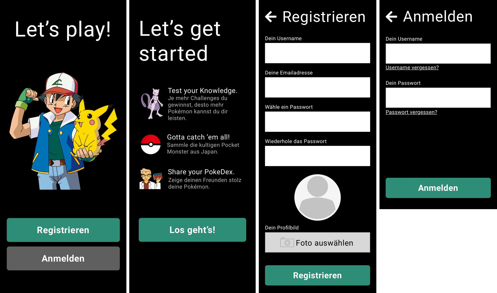

# A Pokemon Quiz Web Application

## An opportunity for Pokémon fans to test their knowledge in the famous game series.
Hi there, fellow developers and potential Pokémon fans.
<div style="">
  
</div>

**What does this application do?**
  - Challenges Pokémon fans though little questions which they would have to answer to in a small amount of time (at the moment the few exisiting questions are only symbolic placeholders).
  - This is my final graduation project at SAE Institute Munich. The idea was to gain and proof knowledge in developing single-page-applications.
  - Concept: by winning challenges, the user receives money in the game, which they can use to buy Pokéballs to obtain new Pokémon. Higher level Pokémon allow more difficult challenges to be set for the community. The more difficult the challenge, the higher the monetary reward.

**What technologies does it use and why?**
  - Webserver: `Apache v2.4.52` as the webserver because it's free, popular and open source.
  - Backend/API: `PHP v8.0.17` (in order to learn object oriented programming && was suggested by the lecturer)
  - Frontend: `React v17.0.2` (in order to develop a single page application)
  - Database server: `MySQL v10.4.24-MariaDB` (mySQL is widely used, easy and quick to install) `phpMyAdmin v5.1.3` 
<br/>

### How to install
To ensure that the project functions properly, it is necessary to install either MAMP or XAMPP, to import the project's database and to start both the local servers for frontend and backend.

MAMP (Mac, Apache, MySQL, PHP) and XAMPP (cross-platform Apache, MariaDB, PHP, Perl) are popular choices for setting up local development environments. They provide all the necessary components, including Apache web server, MySQLdatabase server, and PHP scripting language.

Once installed, you can start the local server environment, and the project will be ready to run on your local machine.

##### Clone the project (CLI):
  ```bash
  git clone https://github.com/svanve/pokemon-quiz.git
  ```

##### Install MAMP or XAMPP
  - MacOS: [MAMP](https://www.mamp.info/de/mamp/mac/)
  - Windows: [XAMPP](https://www.apachefriends.org/de/download.html)
  - Make sure PHP Version 8 is used
##### Import database
  - Go to PhpMyAdmin: 
    - MAMP: press `WebStart`
    - XAMPP: press `Admin` button next to MySQL
  - Create new database named `"pokemon_app"` (press tab "databases")
  - Import database `"db.zip"` from this project (folder `"db_to_import"`) using PhpMyAdmin. 
    - Go see this quick and easy [step-by-step tutorial](https://help.one.com/hc/en-us/articles/115005588189-How-do-I-import-a-database-to-phpMyAdmin) if you need some guidance.
##### Start backend
  The backend uses a package manager called "Composer". Make sure you [install Composer](https://getcomposer.org/download/) first. It allows us to install the required autoloader.

  - MAMP: press `start` in the top right corner.
  - XAMPP: press `start` twice. Once next to Apache and once next MySQL.
  - Move all the files from folder `"backend"` to `"htdocs"`, a subfolder in your MAMP/XAMPP file directory (`~/programs/mamp/htdocs` or `%USERPROFILE%\programs\xampp\htdocs`).
  - Open the `htdocs`folder in your favorite IDE and type into your terminal:
    ```bash
    cd api
    ```
  - Then type:
    ```bash
    composer i
    ```
  Now the server for both the backend and the database are up and running.

##### Start Frontend
  In order to be able to use the frontend you should have installed Node.js which offers NPM, its famous package manager. 
  - In the root folder of the clone change directory to `"react-app"` where the `package.json` is located:
  ```bash
  cd react-app
  ```
  - Install all the packages needed to be able to run the development server:
  ```bash
  npm i
  ```
  - Start the development server:
  ```bash
  npm start
  ``` 
<br/>

### How to use

- Play around with the app
  - Register and create your own user. No worries, since you are working locally you store the hashed credentials in you own database.
  - Create a challenge through the turquoise plus symbol (top right corner), so others would be able to take it.
  - Take a challenge. Press on `"Challenges"`in the menu and find out what user with what pokémon you want to challenge.
  - Edit a challenge of yours. In order to do so set the filter in `"Challenges"` to `"Meine Challenges"`.

### Potential Problems:
- Only for Windows users: You should change the password in the `/backend/api/config.php` from `"root"` to an empty string `""` in order to be able to access the MySQL database.
- Case sensitivity: I think this problem only concerns Mac users. When starting the frontend it does throw errors not being able to find a few files. Just rename the corresponding files (e.g. startOne.js) or folders (e.g. iconComponents) so that they begin with uppercase letters. Otherwise `App.js` can't find these components.

### Credits
- Julian Vogel (Head of Development, SAE Munich) (React expert)
- Philip Braunen (PHP expert)
- <a href="https://github.com/tomniekerken">Tom Niekerken</a> (coding buddy)

<br/>
<br/>
<br/>
<br/>
<br/>
<br/>


Das Backend der App ist nach dem Prinzip **Model-View-Controller** (***MVC***) aufgebaut.

> Username database: `root`
> Passwort database: `root`

Im Verzeichnis ``<Dein Webspace>/api`` befindet sich die `.htaccess`, welche für das Umschreiben der URL zuständig ist. Sie gibt die Parameter aus der Request-URL weiter an die ``index.php``. Diese wiederum ruft die Klasse `API.php` auf, welche aufgrund der Parameter den jeweils entsprechenden Controller aufruft mit der angefragten Methode und allfälligem Argument.


#### 3.2. Frontend

Im Root-Verzeichnis des Frontends liegt die `.env` Konfigurationsdatei. Ändere hier die Backend-URI, bzw. die Serveradresse der API.

Um ein bisschen mit der App rumzuspielen, kannst du den User "Kamelfluesterer" verwenden.

>Username: `Kamelfluesterer`
>
>Email: `camel@desert.gin`
>
>Passwort: `Sagtiev1!`

> **Hinweis:** Die Login Funktion ist nicht vollumfänglich funktionsfähig. Das Austauschen einer ```$user_id``` zwischen Api und Client ist nicht möglich.

---

## 4. Sicherheit

Die PHP-eigene PDO-Klasse wurde verwendet, um CRUD-Operationen auszuführen, ohne die Gefahr von SQL injections. Das Model `<Dein Webspace>/api/src/Model/Database.php` erweitert die PDO-Klasse.

Eingaben seitens der Nutzer werden im entsprechenden Model jeweils mittels der Funktion `filter_input()` gereinigt und vor HTML- und Skript-Eingaben bewahrt (***XSS-Attacken***).

Für die Passwort-Sicherheit wird im ersten Schritt ein zufälliger `$salt` erstellt und mittels der `hash()`-Funktion (`SHA512-Algorithmus`) verschlüsselt. Im zweiten Schritt wird nun das Input-Passwort und der gehashte Salt wieder mittels derselben `hash()`-Funktion verschlüsselt. Gehashtes Passwort und gehashter Salt werden beide in der Datenbank unter der Tabelle `users` zum entsprechenden User abgespeichert.

---

## 5. Funktionalitäten

### 5.1. Account System

> Auf der Route `/`, also auf der Startseite, stehen die USPs zur App. Nach dem Klick auf "Weiter" erscheint die Auswahl "Registrieren" oder "Login".

- #### **Register**

  Über den Button "Registrieren" gibt der User Vorname, Nachname sowie Email-Adresse an und wählt Username und Passwort. Ausserdem lädt der Nutzer ein Profilfoto hoch. Danach ist der Nutzer direkt eingeloggt und kann Challenges einsehen, erstellen, bearbeiten oder löschen.

  >Eine ausführliche Validierung der einzelnen Input-Felder ist integriert im jeweiligen Model. Alle Inputs sind dabei obligatorisch.

- #### **Login**

  Durch erfolgreiche Eingabe des Usernamens und des Passworts kann sich der registrierte Nutzer anmelden und hat Zugriff auf alle Funktionen.

### 5.2. Registrierte versus Unregistrierte Nutzer

Der unregistrierte - oder noch nicht angemeldete - Nutzer hat nur Zugriff auf die beiden Startseiten (siehe Layout unterhalb).

<div>
  
</div>

Beide Layouts liegen - also auch jenes für die eingeloggten User - liegen im Ordner "Layouts". Von dieser Datei (`../Doku/README.md`) aus also: `../Layouts`.

> **Hinweis** Die App kennt keine verschiedenen Rollen zwischen Usern.

### 5.3. Spiellogik

>Der Kern der WebApplication ***PokéCrypt*** ist es, ein Spiel für Pokémon-Fans anzubieten, in welchem sie ihr Wissen rund um die erste von Nintendo veröffentlichte Pokémon Spiele-Generation (Editionen Rot/Blau/Gelb) unter Beweis stellen können und dadurch Pokémon sammeln.

Das Spielprinzip lässt sich wie folgt beschreiben:

- #### **Quiz Fun** 
  
  Der User kann sein Wissen über die Pokemon Editionen Rot/Blau/Gelb unter 
  Zeitdruck in den sogenannten Challenges testen. 

- #### **Community herausfordern**

  Der Spieler kann selbst Challenges erstellen und diese der Community zur Herausforderung stellen.

### 5.4. Challenges

- #### **Challenges einsehen**

  > Um Challenges (Route: `/challenges`) einzusehen navigiert der Spieler auf den Menüpunkt **Challenges** unten links in der Menubar.

  Per Default erscheinen dem User alle Challenges der Community. So kann er direkt eine der Challenges bestreiten.

  Oberhalb der Challenges gibt es Filter- und Sortieroptionen. Über den einen dieser Filterbuttons kommt man dann auch an "Meine Challenges". Mit dem anderen Filter "Community" kommt man wieder in die erste Übersicht.

  Sortieren kann der User nach "Älteste zuerst" (Default), Usernamen, Level des in der Challenge hinterlegten Pokémons oder nach dem Titel.

- #### **Challenge erstellen**

  > Jeder eingeloggte Nutzer kann eine Challenge erstellen. Um eine Challenge zu erstellen, drückt der Nutzer auf das aquamarin-farbene Plussymbol oben rechts in der Header-Leiste.

  Eine Challenge beinhaltet einen Titel, eine Beschreibung, ein zugewiesenes Pokémon und eine zugewiesene Frage. D.h. alle Eingaben sind obligatorisch.

  Der Button mit dem Plussymbol ist von überall aus (im eingeloggten Zustand) erreichbar. Befindet sich die Ansicht im gescrollten Zustand, kann der User mit dem BackToTop-Button wieder auf Scrollpunkt 0 zurückkommen, von wo aus der Header wieder in Klicknähe liegt.

- #### **Challenges bearbeiten**

  > Um eine Challenge zu bearbeiten, geht der User auf den Filter "Meine Challenges" und drückt auf den "Bearbeiten"-Button bei der entsprechenden Challenge-Card.

  In der nun geöffneten Overlay-Maske kann der Nutzer nun Titel, Beschreibung, zugewiesenes Pokemon oder die Frage überschreiben.

- #### **Challenge bestreiten**

  > Um eine Challenge zu bestreiten, geht der User auf den Filter "Community" und drückt auf den Button "Challenge" bei der entsprechenden Challenge-Card.

  Es öffnet sich ein Overlay und der User hat gut 10 Sekunden Zeit, die Frage in der Mitte des Bilschirms zu beantworten. Durch Drücken auf eine der vier Antwortoptionen oder durch Ablaufen der Zeit öffnet sich ein Modal mit der Gewinnmeldung: Richtig oder Falsch.
  
  Durch Schliessen dieses Modals oder durch Drücken auf den Button "Zu den Challenges", kommt der User zu den Challenges zurück.

  In dieser entwickelten Version des Spiels, bewirkt das Erfüllen der Challenge leider noch keine Belohnung oder Ähnliches.

  > **Hinweis** Für das eigentlich vorgesehene Spielprinzip, lese mehr unter Kapitel 5.8. HTTP Problem im Abschnitt [Eingeschränkte Funktionalität](#eingeschränkte-funktionalität).

### 5.5. Pokémons

> Durch Drücken auf den Menüpunkt "Pokémons" kommt der User auf die Route `/pokemons`.

Hier werden alle Pokémons, die es in der Datenbank gibt abgebildet. Der User kann hier Beschriebungen aus dem Nintendo-Spiel zu den einzelnen Pokémon sowie weitere gamespezifische Facts einsehen.

> **Hinweis** Ursprünglich sollten hier die Pokémon aufgelistet werden, die der User selbst besitzt und jeweils deren Level eingesehen werden können.

### 5.6. PokéShop

> Durch Drücken auf den Menüpunkt "PokéShop" kommt der User auf die Route `/pokemons`.

Hier sieht der User nur die Meldung "Am Shop wird gerade garbeitet". Geplant ist hier, die Ansicht der Shopartikel, also verschiedene Pokébälle, die gekauft werden können.

### 5.7. Mein Profil

> Durch Drücken auf den Menüpunkt "Mein Profil" kommt der User auf die Route `/profile`.

Hier sieht der User Daten über sich selbst, die auch auf der Datenbank gespeichert sind wie: Vorname, Nachname, Email, Username und Profilbild.

---

## 6. Code-Struktur

> Die Architektur der App bedient sich des Model-View-Controller Konzepts.

Die `api/Api.php` liest die der URL übergebenen Parameter aus und ruft entsprechend den gewünschten Controller und die Methode mit allfälligen, dazugehörenden Argumenten auf.  

Wird beispielsweise nach dem Rootpfad in die Adresszeile eingegeben: "/challenges/getCommunity/id", so wird der Controller `api/Controller/Challenges.php` aufgerufen, welcher seine Methode "getCommunity" mit dem Paramter "id" aufruft.

### 6.1. Controller

Ein Controller wird stets durch die URL aufgerufen. Ein Controller bedient sich verschiedener Models und gibt 

Ausserdem ruft der Controller bei Bedarf die Views auf und gibt ihnen die jeweils erfolderlichen Daten zur Anzeige mit.

### 6.2. Model

Die Models sprechen hauptsächlich mit der Datenbank und sind für die CRUD-Operationen zuständig und weitere Helferfunktionen. 

### 6.3. View

> **Hinweis** Da die App eine SPA ist, werden die Views nicht vom Backend-Server geholt. Das ganze Frontend steht auf einem separaten, zweiten Server.

Die Ausgabe im Frontend geschieht mittels React. Die JavaScript-Softwarebibliothek React agiert quasi für den View. Also handelt es sich bei der App-Struktur nicht um ein klassisches MVC-Prinzip, bei dem alle Bestandteile auf einem Server abliegen.

---

## 7. Datenbankstruktur

Jede Tabelle hat jeweils einen Primärschlüssel `id`, der auf AUTO_INCREMENT eingestellt ist. Er identifiziert einen Datensatz aus seiner Tabelle eindeutig. Der Primärschlüssel kann in anderen Tabellen als Fremdschlüssel agieren.

### 7.1. Relationales Datenbank-Modell


### 7.2. Tabellen

Die Nutzer der App werden mit fünf Tabellen verwaltet:

- #### **users**
  
Die Tabelle `users` beinhaltet eine `id` (AUTO_INCREMENT) als Primärschlüssel, den Usernamen (`username`), die `email`, das gehashte `password`, den gehashten `salt`, `image_id`, `firstname` und `lastname`. Unique sind hier: `id`, `username`, `email` und `image_id`.

> Die Beziehung von der Tabelle `users` zur Tabelle `challenges` ist eine **1:n** Beziehung (s. [Relationales Datenbank-Modell](#relationales-datenbank-modell)), da ein User mehrere Challenges haben kann.

- #### **challenges**

Die Tabelle `challenges` hat gleich vier Fremdschlüssel (`auhtor_id`, `question_id`, `pokemon_id` und `image_id`).

- #### **Weitere Tabellen**

Die weiteren Tabellen `pokemons`, `images` und `questions` stellen jeweils ihren Primärschlüssel (AUTO_INCREMENT `id`) als Fremdschlüssel in der Tabelle `users` zur Verfügung.

> Die Beziehung von den eben genannten Tabellen zur Tabelle `challenges` ist jeweils eine **1:n** Beziehung (s. [Relationales Datenbank-Modell](#relationales-datenbank-modell)), da ein Pokemon, resp. ein Image, resp. eine Question mehrere Challenges haben kann.
