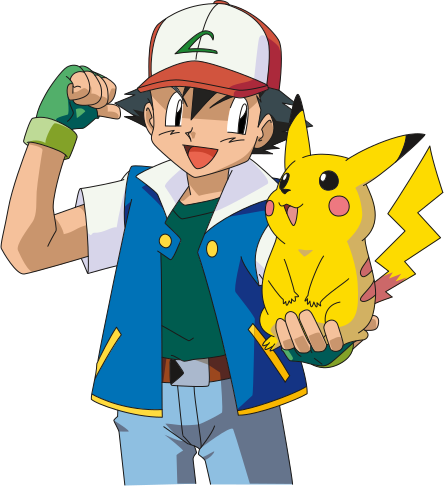

# A Pokemon Quiz Web Application

## An opportunity for Pokémon fans to test their knowledge in the famous game series.
Hi there, fellow developers and potential Pokémon fans.
<div style="">
  
</div>

**What does this application do?**
  - Challenges Pokémon fans though little questions which they would have to answer to in a small amount of time (at the moment the few exisiting questions are only symbolic placeholders).
  - This is my final graduation project at SAE Institute Munich. The idea was to gain and proof knowledge in developing single-page-applications.
  - Concept: by winning challenges, the user receives money in the game, which they can use to buy Pokéballs to obtain new Pokémon. Higher level Pokémon allow more difficult challenges to be set for the community. The more difficult the challengeyou successfully take, the higher the monetary reward.

**What technologies does it use and why?**
  - Backend/API: `PHP v8.0.17`, so that I learn how to write an object oriented backend.
  - Frontend: `React v17.0.2`, in order to develop a single page application and to be manipulating a virtual DOM based on user interactions or state changes (Client Rendering).
  - Styling: `Bootstrap` and `SCSS` because it's quick and easy to use.
  - `MAMP` comes with: 
    - Webserver: `Apache v2.4.52`, popular and open source
    - Database server: `MySQL v10.4.24-MariaDB`, widely used and easy
    - Database management tool: `phpMyAdmin v5.1.3`.
<br/>

### How to install
To ensure that the project works properly, it is necessary to install either MAMP or XAMPP, to import the project's database and to start both the local servers for frontend and backend.

MAMP (Mac, Apache, MySQL, PHP) and XAMPP (cross-platform Apache, MariaDB, PHP, Perl) are popular choices for setting up local development environments. They provide all the necessary components, including Apache web server, MySQLdatabase server, and PHP scripting language.

Once installed, you can start the local server environment, and the project will be ready to run on your local machine.

#### Clone the project (CLI):
  ```bash
  git clone https://github.com/svanve/pokemon-quiz.git
  ```

#### Install MAMP or XAMPP
  - MacOS: [MAMP](https://www.mamp.info/de/mamp/mac/)
  - Windows: [XAMPP](https://www.apachefriends.org/de/download.html)
  - Make sure PHP Version 8 is used
#### Import database
  - Go to PhpMyAdmin: 
    - MAMP: press `WebStart`
    - XAMPP: press `Admin` button next to MySQL
  - Create new database named `"pokemon_app"` (press tab "Databases")
  - Open "SQL" tab of the new database. Copy paste the text from `"db.rtf"` (root folder `"exports"`) into mySQL editor and press the button `Go`. 
  - After a page refresh you should see five tables inside the database `"pokemon-app"`.
#### Start backend
  The backend uses a package manager called "Composer". It allows us to install the required autoloader.

  - [Install Composer](https://getcomposer.org/download/).
  - MAMP: press `start` in the top right corner.
  - XAMPP: press `start` twice. Once next to Apache and once next MySQL.
  - Move all the files from folder `"backend"` to `"htdocs"`, a subfolder in your MAMP/XAMPP file directory (`~/programs/mamp/htdocs` or `%USERPROFILE%\programs\xampp\htdocs`).
  - Open your favorite IDE and navigate to the `"htdocs"` folder. Once there, open a terminal window and type the following command:
    ```bash
    cd api
    ```
  - And then install the autolaoder from `composer.json`:
    ```bash
    composer i
    ```
  - *XAMPP users only: You should change the password in the `/backend/api/config.php` from `"root"`to an empty string `""` in order to be able to access the MySQL database:*
  ```php
  define('DB_PASS', '');
  ```
#### Start Frontend
  In order to be able to use the frontend you should have Node.js installed which offers NPM, its famous package manager. 
  - In the root folder of the clone change directory to `"react-app"` where the `package.json` is located:
  ```bash
  cd react-app
  ```
  - Install all the packages needed to be able to run the development server:
  ```bash
  npm i
  ```
  - Start the development server:
  ```bash
  npm start
  ```
Now you should be all set to use the web application. 
<br/>

### How to use

- Play around with the app
  - Register and create your own user. No worries, since you are working locally you store the hashed credentials in your own database.
  - Create a challenge through the turquoise plus symbol (top right corner), so others would be able to take it.
  - Take a challenge. Press on `"Challenges"`in the menu and find out what user with what pokémon you want to challenge.
  - Edit a challenge of yours. In order to do so set the filter in `"Challenges"` to `"Meine Challenges"`.

### Potential Problems:
- Case sensitivity: I think this problem only concerns Mac users. When starting the frontend it does throw errors not being able to find a few files. Just rename the corresponding files (e.g. startOne.js) or folders (e.g. iconComponents) so that they begin with uppercase letters. Otherwise `App.js` can't find these components.

### Credits
- Julian Vogel (Head of Development, SAE Munich) (React expert)
- Philip Braunen (PHP expert)
- <a href="https://github.com/tomniekerken">Tom Niekerken</a> (coding buddy)